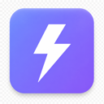
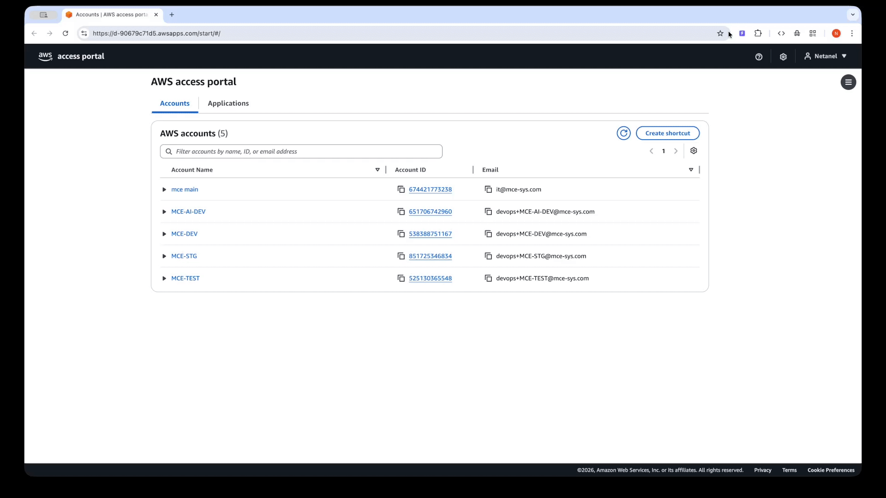

<div align="center">
  

  # AWS Shortcut

  **One-click access to any AWS account, role, region, and service — straight from your browser.**

  No CLI. No credentials on disk. No new login. Piggybacks on your existing IAM Identity Center (AWS SSO) browser session.
</div>

---

<p align="center">
  
</p>

## Why

If you work across many AWS accounts, you know the dance:

> Open IAM Identity Center → click your account → click the right role → wait for federation redirect → finally land in the console → realize you wanted a different region → repeat.

AWS Shortcut collapses that into **one click in a side panel**. It reuses the AWS sign-in you already did — no second login, no proxy, no new identity provider.

## What it does

- 🔍 **Fuzzy service search** — type `lambda` to find Lambda. Type `instance` to find EC2 Instances. The extension ships with a catalog of every AWS service + the most common features inside each.
- ⚡ **One click → console open** — pick `account · role · region · service`, and a console tab opens directly on that view.
- 🪟 **Multi-session aware** — when you have AWS multi-session console enabled, it deep-links to the right `<account>-<session>.region.console.aws.amazon.com` subdomain so multiple accounts stay open simultaneously without signing each other out.
- 📌 **Favorites** — pin combos you use daily (`Production · Lambda · Functions · us-east-1`). Click → console.
- 🕒 **Recents** — recently-closed AWS console tabs are remembered. Click → reopen.
- 🎨 **Account colors + region awareness** — the panel mirrors the color band you set on each account in the AWS console, so production stands out from staging at a glance.
- ⌨️ **Keyboard shortcut** — `Cmd+Shift+A` (macOS) / `Ctrl+Shift+A` (Win/Linux). Search-as-you-type, Enter to launch.

## What it does NOT do — privacy & identity guarantees

This is the part that matters. Before you install:

- ❌ **The extension does not replace AWS sign-in.** You still log in to IAM Identity Center the normal way, in a normal AWS-hosted tab. The extension never sees your username, password, or MFA code.
- ❌ **The extension is not an identity provider.** It does not host an auth flow, it does not proxy your credentials through any server, and it does not run any backend. There are no servers operated by the extension authors — period.
- ❌ **The extension does not store your SSO credentials.** It never sees your password. The bearer token your browser already sends to `portal.sso.<region>.amazonaws.com` is read in-memory inside the extension's service worker and held in `chrome.storage.session` (cleared when Chrome closes). It is never written to disk in plaintext, never sent anywhere, and never shared with another extension.
- ❌ **No telemetry. No analytics. No remote logging. No ads.** The extension does not phone home.
- ✅ **All data stays on your device.** Account list, role/region prefs, favorites, layout — all in `chrome.storage.sync` (Google syncs that across your own Chrome profile, encrypted in transit; nothing extra goes through the extension authors).
- ✅ **Open source under MIT.** Every line of code that touches your data is in this repo. Audit before you trust.

For the full data-flow disclosure, see [PRIVACY.md](PRIVACY.md).

## Install

### Chrome Web Store

[**Install AWS Shortcut from the Chrome Web Store**](https://chromewebstore.google.com/detail/aws-shortcut/mghiiolahhdjkaddijlflhegpopdbbjd) — easiest path. Click *Add to Chrome*, pin the toolbar icon, you're done.

For release notes, see the [GitHub releases page](https://github.com/mceSystems/aws-shortcuts/releases).

### From source (manual unpacked)

```bash
git clone https://github.com/mceSystems/aws-shortcuts.git
cd aws-shortcuts
npm install
npm run build
```

Then in Chrome:

1. Open `chrome://extensions`.
2. Toggle **Developer mode** (top-right corner).
3. Click **Load unpacked** → select the freshly built `dist/` folder.
4. Pin the AWS Shortcut icon to your toolbar (puzzle-piece icon → pin).

That's it. No npm globals, no CLI tools, no AWS credentials needed at install time.

## First-time setup (≈ 2 minutes)

When you first click the toolbar icon, you'll see a 3-step onboarding:

### 1. Connect your access portal

Paste your IAM Identity Center **start URL**. It looks like:

```
https://d-xxxxxxxxxx.awsapps.com/start/
```

(You can find it in the AWS console under *IAM Identity Center → Settings → AWS access portal URL*.)

If you already have the portal open in another tab, the extension will auto-detect it — just click the suggestion.

The extension does not log you in. Clicking **Open & scan** opens your portal in the normal AWS sign-in flow if you're not already signed in. Once you complete AWS's own login (with your usual MFA, etc.), control returns to the extension.

### 2. Enable multi-session

For best results, turn on AWS multi-session console (top-right of `console.aws.amazon.com` → **Multi-session** → *Turn on*). The extension uses this so switching accounts in the side panel doesn't sign you out of the others.

If you skip this step, the extension still works — it just falls back to the federation redirect every time, which is slower.

### 3. Scan

The extension calls the AWS portal API (the same one your browser already calls when you visit the portal page) to enumerate the accounts and roles you have access to. The list is stored locally.

Done. The side panel now shows your accounts.

## Daily use

Once set up, the typical flow is:

1. Hit `Cmd/Ctrl+Shift+A` — side panel opens.
2. **Pick an account** in the *Account* section (or it remembers the last one you used).
3. **Type a service** in the search box — `lambda`, `s3`, `cloudwatch logs`, `instance`, anything fuzzy.
4. **Press Enter** — a console tab opens at the right account, role, and region.

Refinements:

- **Different role / region for one click** — click the chip on the account row to change without setting a global default.
- **Save a favorite** — when the right combo is selected, hit `Shift+Enter` (or click the ☆ icon) to pin it. Favorites tab → click → launch.
- **Reopen a closed tab** — switch to the *Tabs* pill, then *Recently closed*. One click reopens at the same account/role/region.
- **Reorder sections** — drag section headers in the side panel; collapse what you don't need today.

You'll never type a password through this extension. The first time per browser session, AWS itself may ask you to re-authenticate (because IAM Identity Center bearer tokens expire) — that happens in the AWS-hosted portal tab, the same as without the extension.

## How a click becomes a console tab

Two paths, picked automatically:

1. **Live session reuse** — if you already have a multi-session console tab open for the target account, the extension builds a direct URL to the chosen service + feature on that account's session subdomain (`<account>-<session>.<region>.console.aws.amazon.com/<service>/...`) and opens it. Instant — no redirect.
2. **Identity portal launch** — if no live session matches, the extension builds a federation URL through your IAM Identity Center start page that lands directly on the chosen service/feature in the chosen account/role/region. AWS handles the sign-in (or reuses your existing portal cookies), then redirects to the right console URL.

Either way, **you never re-enter credentials through the extension** — AWS does the auth, the extension only assembles the right URL.

For a deeper architecture write-up, see [`design.md`](design.md) (UI spec) and [`docs/CATALOG.md`](docs/CATALOG.md) (catalog pipeline).

## Permissions

The extension requests the minimum set needed for the features above:

| Permission | Why |
|---|---|
| `cookies` | Detect whether your multi-session AWS console subdomain has a live session — only checks **presence + expiry**, never reads cookie values. |
| `webRequest` | Read the `Authorization: Bearer` header on outgoing portal API calls so the extension can call the same API on your behalf. |
| `declarativeNetRequest` | Rewrite `Origin` / `Referer` headers on extension-initiated requests so the portal API accepts them. |
| `tabs` + `scripting` | Discover open AWS console tabs and inject the small content script that observes account/role/region. |
| `sidePanel` | The side-panel UI itself. |
| `storage`, `notifications`, `alarms` | Persist accounts/favorites/prefs locally; daily catalog refresh; "scan complete" notification. |
| Host access to AWS endpoints (`portal.sso.*.amazonaws.com`, `*.awsapps.com`, `*.console.aws.amazon.com`, `*.signin.aws.amazon.com`) | The AWS endpoints the extension reads from. |
| Host access to `cdn.jsdelivr.net` + `raw.githubusercontent.com` | Service catalog refresh from this public repo. |

Full permission justifications: see [PRIVACY.md](PRIVACY.md) and [docs/STORE_LISTING.md](docs/STORE_LISTING.md).

## Development

```bash
npm install
npm run dev          # Vite dev server with HMR
npm run typecheck    # tsc --noEmit (panel + scripts)
npm run build        # production build → dist/
```

Load `dist/` as an unpacked extension while iterating.

### Service catalog updates

```bash
npm run catalog:auth        # one-time Playwright SSO sign-in
npm run catalog:services    # harvest services from live AWS console
npm run catalog:features    # harvest per-service features
npm run catalog:icons       # build base64-encoded icon map
npm run catalog:all         # all of the above in sequence
```

See [docs/CATALOG.md](docs/CATALOG.md) for details.

## Contributing

PRs welcome. See [CONTRIBUTING.md](CONTRIBUTING.md) for the quality bar.

## Security

For security vulnerabilities, please **do not open a public issue**. See [SECURITY.md](SECURITY.md) for the disclosure process.

## License

[MIT](LICENSE) © MCE Systems
